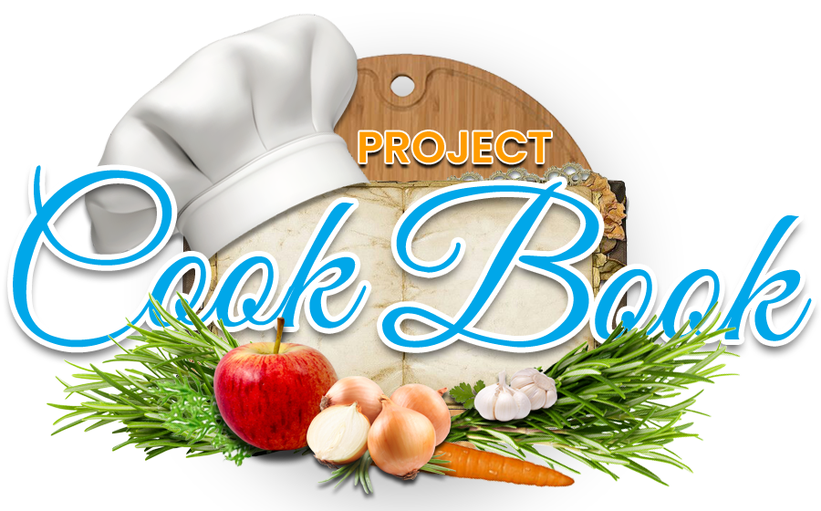

# API.CookBook
## PWSZ N3PAM / ZMP PROJECT 

Vue.js / Firebase / API

## API
Meals: [API webpage - https://www.themealdb.com/api.php](https://www.themealdb.com/api.php).

Cocktails: [API webpage - https://www.thecocktaildb.com/api.php](https://www.thecocktaildb.com/api.php).

## Project website
[API.Cookbook https://cookbook-307109.web.app](https://cookbook-307109.web.app)

